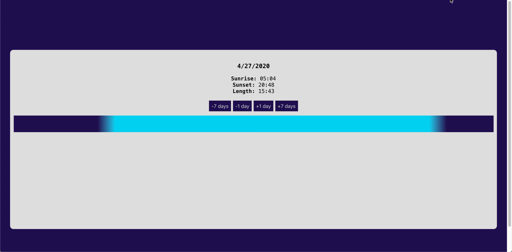

# Sunrise/Sunset Gradient App

### 1 Purpose
Application, which retrieving async data and graphically displaying it.

### 2 Libraries
* Create react app

### 3 Features
* Without deps
* Using external API service (https://sunrise-sunset.org/api)
* Linear gradient animation using requestAnimationFrame
* React hooks
* Geo API
* Advanced Linting
* Detailed view of requests and responses

### 4 Screenshot

### 5 Demo
https://menemy.github.io/cra-sunrise-sunset
